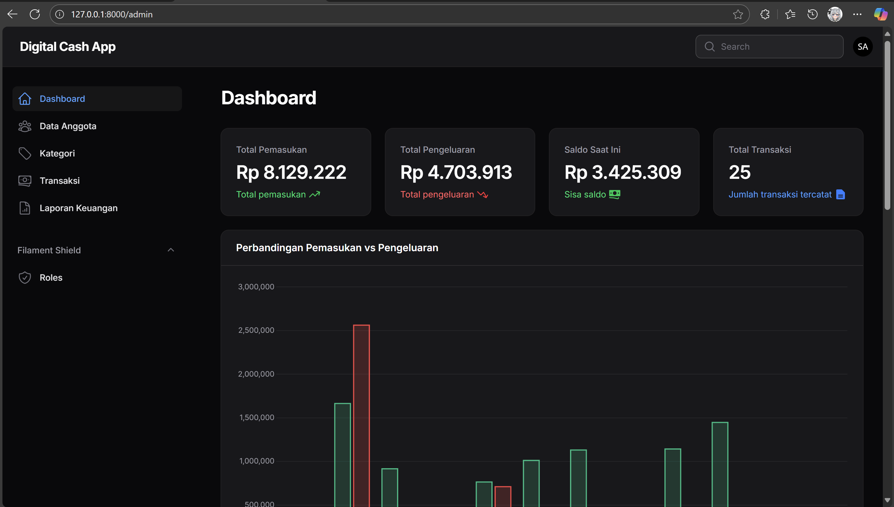
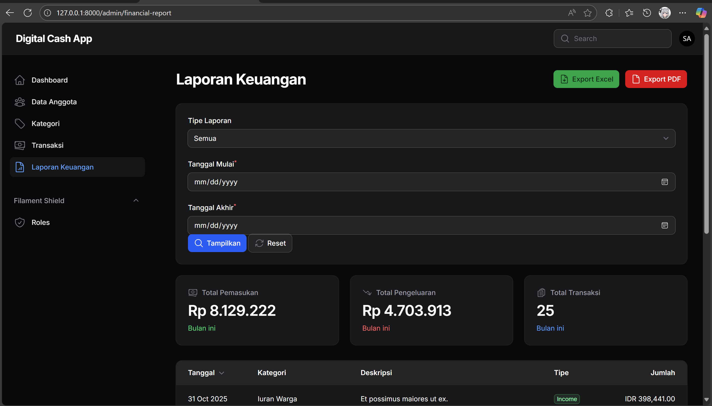

# 🧾 Digital Cash App Documentation

> **Versi:** 1.0.0
> **Framework:** Laravel 12 + Filament Admin Panel
> **Author:** Manzzzx

---

## 🚀 Deskripsi Singkat Proyek

**Digital Cash App** adalah aplikasi manajemen kas warga berbasis web yang dibangun menggunakan **Laravel + Filament Admin Panel**.
Aplikasi ini membantu pengurus RT/RW atau komunitas dalam mencatat pemasukan, pengeluaran, dan menampilkan laporan keuangan secara transparan.

### 🎯 Fitur Utama

* Login & otentikasi admin (Filament Panel)
* Manajemen Data Anggota
* Kategori Transaksi (Iuran, Donasi, Belanja, dll)
* Transaksi Pemasukan & Pengeluaran
* Laporan Keuangan interaktif dengan filter
* Export ke Excel & PDF
* Dashboard statistik realtime (chart & summary)
* (Coming Soon) Laporan publik untuk warga (readonly viewer)

---

## 🧰 Setup & CLI Commands

Langkah-langkah pembuatan komponen utama laporan keuangan:

```bash
# 1️⃣ Buat halaman laporan
php artisan make:filament-page FinancialReport

# 2️⃣ Buat widget filter laporan
php artisan make:filament-widget WidgetFinancialFilter --panel=admin

# 3️⃣ Buat widget ringkasan (summary)
php artisan make:filament-widget WidgetFinancialSummary --panel=admin

# 4️⃣ Buat widget tabel transaksi
php artisan make:filament-widget WidgetFinancialTable --panel=admin --type=table --model=Transaction

# 5️⃣ (Opsional) Buat export Excel class
php artisan make:export FinancialReportExport --model=Transaction
```

Setelah semua file dibuat, jalankan:

```bash
composer dump-autoload
php artisan optimize:clear
```

---

## 📄 Financial Report Page

File: `app/Filament/Pages/FinancialReport.php`

```php
protected static ?int $navigationSort = 5;
protected static ?string $navigationLabel = 'Laporan Keuangan';
protected static ?string $title = 'Laporan Keuangan';
protected static string $view = 'filament.pages.financial-report';

protected function getHeaderWidgets(): array
{
    return [
        \App\Filament\Widgets\WidgetFinancialFilter::class,
        \App\Filament\Widgets\WidgetFinancialSummary::class,
    ];
}

protected function getFooterWidgets(): array
{
    return [
        \App\Filament\Widgets\WidgetFinancialTable::class,
    ];
}
```

📘 Fungsi utama halaman ini:

* Menampung seluruh widget laporan keuangan.
* Mengatur posisi Filter, Summary, dan Table di tampilan.
* Menggunakan `navigationSort` agar muncul di urutan ke-5 di sidebar.

---

## ⚙️ Widget: Financial Filter

File: `app/Filament/Widgets/WidgetFinancialFilter.php`

Fitur:

* Filter tanggal mulai, tanggal akhir, dan tipe laporan (Semua / Income / Expense)
* Tombol reset & tampilkan
* Dispatch event Livewire `filter-updated`

Kode penting:

```php
public function applyFilter(): void
{
    $data = $this->form->getState();
    $this->dispatch('filter-updated', [
        'report_type' => $data['report_type'],
        'start_date' => $data['start_date'],
        'end_date' => $data['end_date'],
    ]);
}
```

---

## 📊 Widget: Financial Summary

File: `app/Filament/Widgets/WidgetFinancialSummary.php`

Menampilkan total pemasukan, pengeluaran, dan jumlah transaksi.
Widget ini bereaksi terhadap event `filter-updated` untuk memperbarui datanya secara real-time.

---

## 📋 Widget: Financial Table

File: `app/Filament/Widgets/WidgetFinancialTable.php`

Menampilkan daftar transaksi yang difilter berdasarkan tanggal dan tipe laporan.
Menggunakan `Tables\Columns\TextColumn` dan `Tables\Columns\BadgeColumn` untuk menampilkan data dengan styling modern.

---

## 📤 Export Fitur (Excel & PDF)

### 🧩 Excel Export:

Menggunakan `Maatwebsite\Excel`:

```php
return Excel::download(
    new FinancialReportExport($rows, $this->start_date, $this->end_date, $this->report_type),
    "Laporan_Keuangan_{$this->start_date}_sampai_{$this->end_date}.xlsx"
);
```

### 🧩 PDF Export:

Menggunakan `Barryvdh\DomPDF`:

```php
$pdf = Pdf::loadView('pdf.financial-report', [
    'transactions' => $rows,
    'start_date' => $this->start_date,
    'end_date' => $this->end_date,
    'total_income' => $this->total_income,
    'total_expense' => $this->total_expense,
    'total_transactions' => $this->total_transactions,
])->setPaper('a4', 'portrait');
```

---

## 🌱 Seeder & Factory (Data Dummy)

Supaya semua fitur laporan bisa dites tanpa input manual, gunakan **Seeder dan Factory** untuk membuat data otomatis.

### 📦 Model yang Disertakan

* `Category` — untuk kategori transaksi (Iuran, Donasi, Belanja)
* `Member` — untuk data anggota warga
* `Transaction` — untuk data pemasukan/pengeluaran

### 🧩 Contoh Factory

`database/factories/TransactionFactory.php`

```php
use App\Models\Category;
use Illuminate\Database\Eloquent\Factories\Factory;

class TransactionFactory extends Factory
{
    public function definition(): array
    {
        return [
            'category_id' => Category::inRandomOrder()->first()?->id ?? Category::factory(),
            'type' => $this->faker->randomElement(['income', 'expense']),
            'description' => $this->faker->sentence(),
            'amount' => $this->faker->numberBetween(50000, 2000000),
            'date' => $this->faker->dateTimeBetween('-2 months', 'now'),
        ];
    }
}
```

### 🌿 Contoh Seeder

`database/seeders/DatabaseSeeder.php`

```php
use App\Models\Category;
use App\Models\Member;
use App\Models\Transaction;

public function run(): void
{
    Category::factory()->count(5)->create();
    Member::factory()->count(10)->create();
    Transaction::factory()->count(50)->create();

    $this->command->info('✅ Seeder selesai! 5 kategori, 10 anggota, dan 50 transaksi berhasil dibuat.');
}
```

### 🧠 Jalankan Seeder

```bash
php artisan migrate:fresh --seed
```

---

## 🧩 Setup Guide

Langkah-langkah untuk developer lain yang ingin menjalankan proyek ini setelah melakukan clone dari GitHub.

### 1️⃣ Clone Repository

```bash
git clone https://github.com/username/digital-cash-app.git
cd digital-cash-app
```

### 2️⃣ Install Dependencies

```bash
composer install
npm install
```

> ⚠️ Pastikan PHP ≥ 8.2 (Filament v4 & Laravel 12 membutuhkan PHP versi ini)

### 3️⃣ Setup File `.env`

```bash
cp .env.example .env
```

Ubah variabel environment penting:

```env
APP_NAME="Digital Cash App"
APP_URL=http://127.0.0.1:8000
DB_CONNECTION=mysql
DB_DATABASE=digitalcash_app
DB_USERNAME=root
DB_PASSWORD=
```

### 4️⃣ Generate App Key

```bash
php artisan key:generate
```

### 5️⃣ Migrasi & Seeder

```bash
php artisan migrate:fresh --seed
```

### 6️⃣ Jalankan Server & Vite

```bash
php artisan serve
npm run dev
```

Akses:

```
http://127.0.0.1:8000/admin
```

### 7️⃣ Login ke Admin Panel

Gunakan akun default dari seeder atau buat manual.
Contoh default:

```
Email: superadmin@digitalcash.app
Password: password
```

### 8️⃣ Link Storage

```bash
php artisan storage:link
```


### 9️⃣ Optimisasi Akhir

```bash
php artisan optimize:clear
```
---

## 🖼️ Live Demo Preview

📸 Contoh:



---